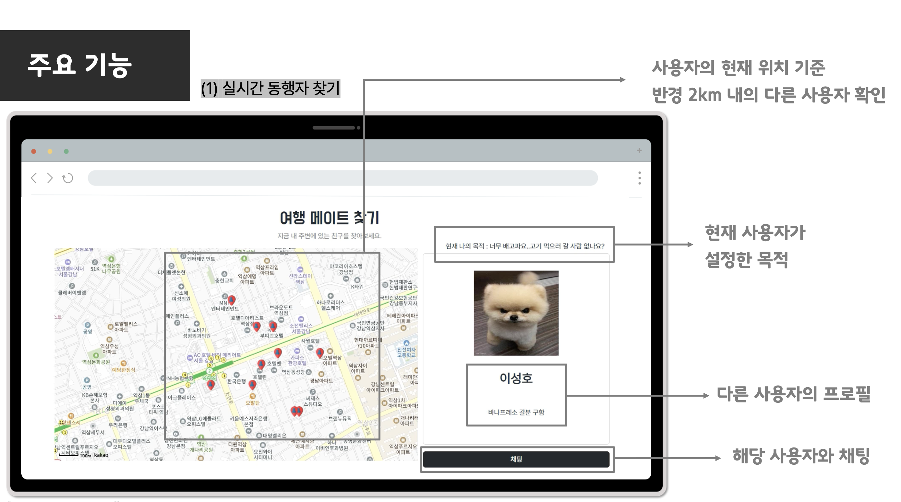
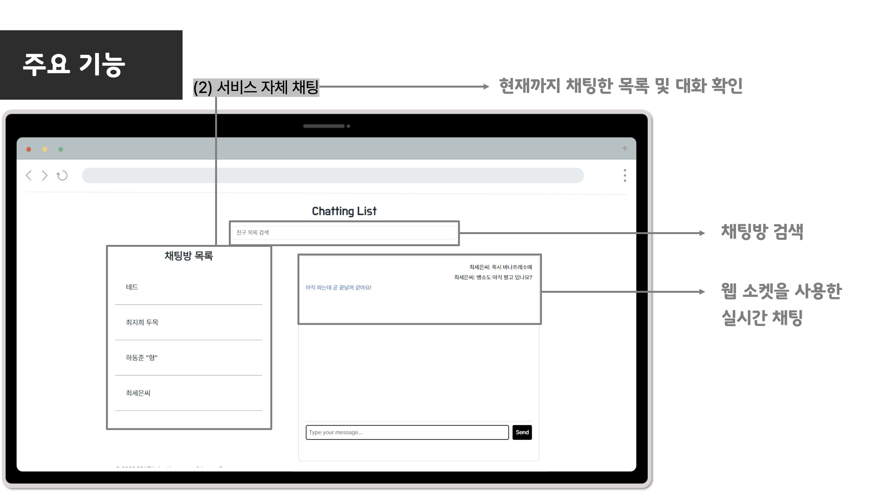
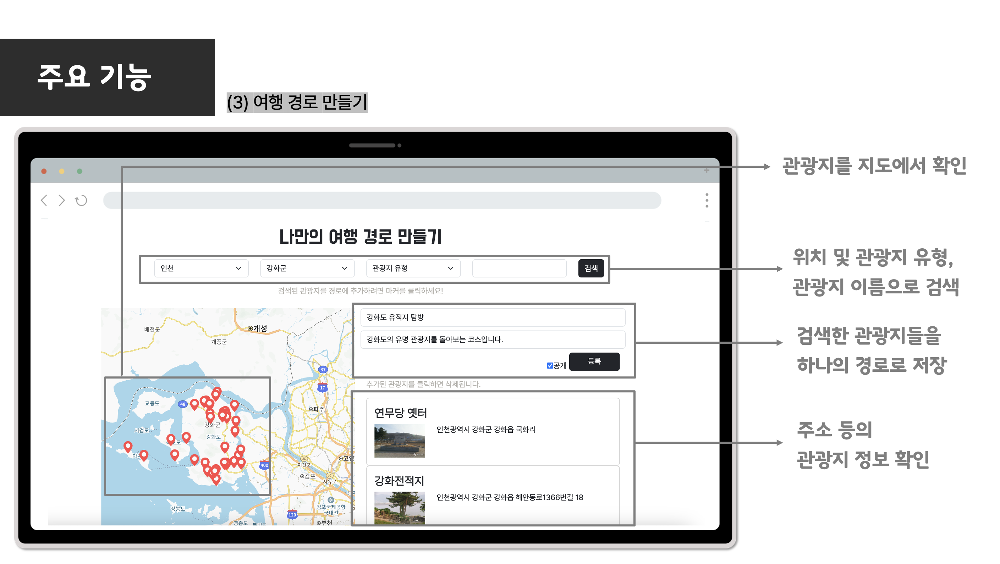
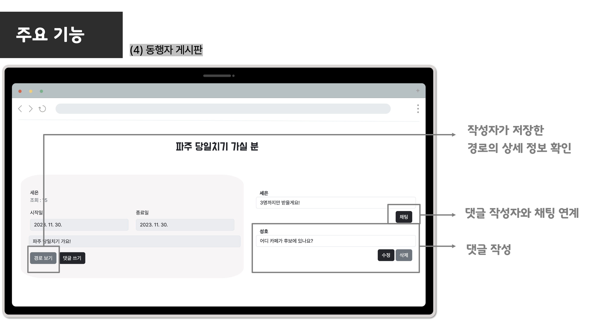

# ✈️ HappyTrip ; 여행 친구 찾기 서비스 
### 부제 : 성호와 세으니의 우당탕탕 MSA 도전기

## 👫 참여자

<!--    -->

| |  ||
|:--------:|:--------:|:--------:|
|-|  [성호](https://github.com/SunghoLee98)   | [세은](https://github.com/ChoiSeEun)|
|역할 | 개발환경 세팅 및 Redis DB 구축  User service 개발   Location service 개발   Chat service 개발 | 각 서비스 DB(MySQL) 구축   웹 페이지 UI 개발   Community Service 개발

## 1️⃣ 서비스 개요 

## 2️⃣ 시스템 아키텍처

## 3️⃣ 주요 서비스
### ➀ [위치 기반 동행자 찾기](https://github.com/Don-tBeAngry/happytrip-distance-service)
- 사용자의 현재 위치를 기반으로 반경 2km 내에 존재하는 다른 사용자를 확인할 수 있습니다.
- 해당 서비스를 이용하기 위해서는 회원가입과 사용하고자 하는 목적 등록이 필수로 요구됩니다.
- 마커를 누르면 다른 사용자의 이름과 사용 목적을 확인할 수 있으며, 해당 사용자와 바로 채팅이 가능합니다.
 

||  |
|:--------:|:--------:|

<!--  
 -->

### ➁ [실시간 채팅](https://github.com/Don-tBeAngry/happytrip-chat-service)
- 사용자 간 1:1 채팅이 가능합니다.
- [➀ 위치 기반 동행자 찾기] 서비스와 [➁ 게시판 기반 친구 찾기] 서비스에서 바로 사용할 수 있습니다.
- 대화 내역의 저장 또한 가능하며, 현재까지 진행한 채팅은 페이지 상단 navbar의 채팅 목록 페이지에서 확인할 수 있습니다.
- 채팅 목록 페이지에서는 대화상대 검색이 가능합니다.

||  |
|:--------:|:--------:|

### ➂ [여행 경로 제작](https://github.com/Don-tBeAngry/happytrip-community-service)
- 공공 API에서 제공하는 데이터를 가공하여 3만개 이상의 관광지 정보를 제공합니다.
- 시/도, 구/군, 관광지 유형, 관광지명 검색을 지원하며 추가 정보를 입력하지 않고 검색하게 되면 DB 내의 모든 관광지가 지도에 표시됩니다.
- 마커에서 관광지 정보를 확인할 수 있고 마커를 클릭하면 자신의 경로로 추가가 가능합니다.
- 추가된 관광지를 다시 선택하면 경로에서 관광지가 삭제되고, 최종으로 등록된 경로는 [추천경로] 및 [마이페이지] 에서 확인이 가능합니다.
- [추천경로] 는 추천 수 정렬되며, 공개로 설정된 경로만 보여집니다. 

  
||  |
|:--------:|:--------:|

### ④ [게시판 기반 친구 찾기](https://github.com/Don-tBeAngry/happytrip-community-service)
- [자유 게시판]과 별도의 게시판으로, 여행 동행자 찾기에 특화된 게시판입니다.
- 글 등록 시 제목/내용과 더불어 여행 시작일/종료일을 지정할 수 있고, [➂ 여행 경로 제작]에서 저장한 경로를 추가할 수도 있습니다.
- 이미 동행을 찾았거나, 여행 종료일이 지난 경우에는 게시글을 클릭할 수 없으며 마감된 경로는 제외하고 볼 수도 있습니다.
- 가고 싶은 여행지에 기반한 검색 또한 지원합니다.
- 게시글을 클릭하면 상세 정보와 함께, 등록된 경로에 포함된 관광지의 위치와 정보를 확인 가능합니다.
- 게시글에 댓글을 달 수 있으며, 작성자는 댓글을 단 사용자에게 채팅을 걸 수 있습니다. 

||  |
|:--------:|:--------:|

