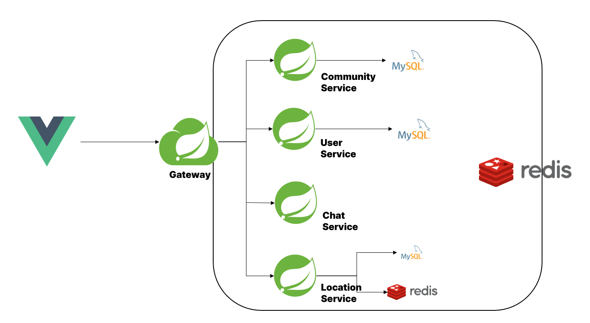

# ✈️ HappyTrip ; 여행 친구 찾기 서비스 
### 부제 : 성호와 세으니의 우당탕탕 MSA 도전기

## 👫 참여자

<!--    -->

| |  ||
|:--------:|:--------:|:--------:|
|-|  [성호](https://github.com/SunghoLee98)   | [세은](https://github.com/ChoiSeEun)|
|역할 | 개발환경 세팅 및 Redis DB 구축  User service 개발   Location service 개발   Chat service 개발 | 각 서비스 DB(MySQL) 구축   웹 페이지 UI 개발   Community Service 개발

## 1️⃣ 서비스 개요 

## 2️⃣ 시스템 아키텍처

## 3️⃣ 서비스 시연 
### (1) 위치 기반 친구 찾기 서비스

### (2) 실시간 채팅 서비스

### (3) 여행 경로 제작 서비스

### (4) 게시판 기반 친구 찾기 서비스

